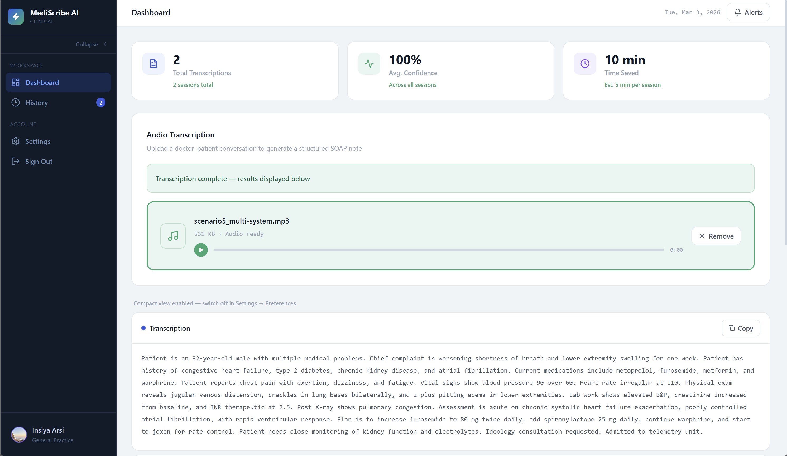
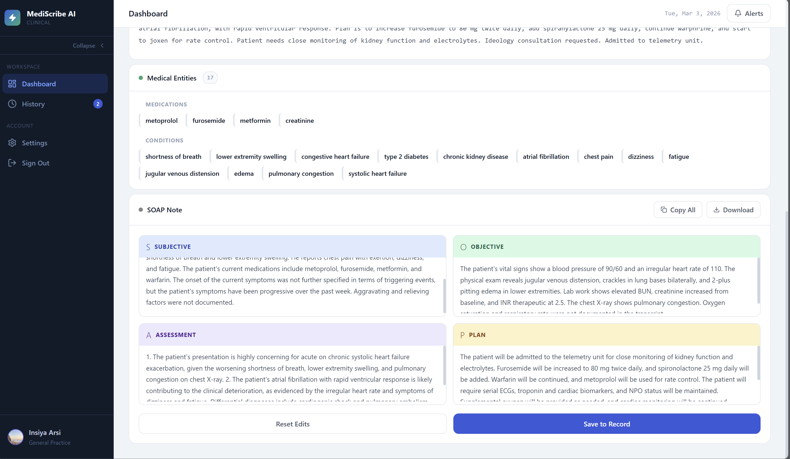

# MediScribe AI

A full-stack clinical documentation system that converts doctor–patient audio conversations into structured SOAP notes using speech recognition, biomedical NLP, and LLM-generated clinical prose.




[](https://github.com/insiyaarsi/mediscribe-ai)
[](https://github.com/insiyaarsi/mediscribe-ai)
[](LICENSE)

---

## Overview

MediScribe AI takes a recorded clinical encounter and produces a documentation-grade SOAP note in under 2 minutes. The pipeline runs speech-to-text transcription locally via Whisper, extracts medical entities using a biomedical NLP model trained on clinical corpora, validates that the content is genuinely medical before committing to further processing, and then generates clinical prose via the Groq API with a rule-based fallback to guarantee output even when the API is unavailable.

The frontend is a production-quality React application with full dark mode, session history, user preferences, and inline SOAP note editing.

---

## Pipeline

```
Audio Upload
    │
    ▼
Whisper (local) ── Speech-to-text transcription
    │
    ▼
Content Validator ── Dual-criteria medical gate (density + markers)
    │                Rejects non-medical audio before NLP runs
    │
    ▼
scispaCy en_ner_bc5cdr_md ── Biomedical NER (CHEMICAL / DISEASE labels)
    │                         Trained on BC5CDR clinical corpus
    │
    ▼
Entity Categoriser ── Maps to SYMPTOM / MEDICATION / CONDITION /
    │                  PROCEDURE / TEST using 700+ term dictionary
    │
    ▼
Groq llama-3.3-70b-versatile ── SOAP note generation (clinical prose)
    │   └── Rule-based fallback if API unavailable
    │
    ▼
React Frontend ── Entity chips, editable SOAP sections, history, export
```

---

## Key Features

**Processing**
- Local Whisper transcription — no external speech API, no per-minute cost
- `en_ner_bc5cdr_md` biomedical NER — trained on clinical literature, not general web text
- Content validation gate — prevents SOAP generation from non-medical recordings
- Groq-powered SOAP generation — documentation-grade clinical prose with OPQRST structure, normalised medication names, and standard-of-care additions
- Rule-based fallback — pipeline always produces a valid SOAP dict even if Groq is unreachable

**Frontend**
- Colour-coded entity chips by category (symptoms, medications, conditions, procedures, tests)
- Editable SOAP note sections — clinician can amend before downloading
- Full dark mode across all pages and components
- Session history with per-entry confidence scores, entity counts, and SOAP export
- User preferences (auto-scroll, compact view, confidence display, auto-copy)
- Audio preview player before transcription

---

## Architecture Decisions

### Why `en_ner_bc5cdr_md` over `en_core_sci_sm`

`en_core_sci_sm` is a general biomedical model trained on PubMed abstracts. `en_ner_bc5cdr_md` is trained specifically on the BC5CDR corpus — a dataset of annotated clinical case reports — and returns two high-precision labels: `CHEMICAL` (mapped to medications) and `DISEASE` (mapped to conditions and symptoms). For a clinical transcription use case, precision on drug and disease names matters more than broad entity coverage, which made `en_ner_bc5cdr_md` the better fit despite its narrower label set.

### Why Groq over OpenAI for SOAP generation

The SOAP generator originally used a rule-based template system that produced structured dicts rather than clinical prose. Replacing it with an LLM was necessary to generate the kind of fluent, documentation-grade notes a clinician would actually review. Groq's free tier provides `llama-3.3-70b-versatile` with sufficient context length and low enough latency for a synchronous pipeline. The OpenAI API would introduce per-token cost at scale; Groq eliminates that for a portfolio project while still producing comparable output quality for clinical prose tasks.

### Why a rule-based fallback exists

LLM API calls can fail — rate limits, network timeouts, invalid keys on first run. A SOAP generator that raises an exception breaks the entire pipeline for the clinician. The fallback produces a valid SOAP dict from the already-extracted entities so the frontend always receives something useful, and the `source` field in the response tells the frontend which path was taken.

### Why the content validator uses AND logic

The validator requires both a minimum medical term density (10%) and a minimum number of clinical context markers (2). Using OR would let dense-but-generic text (e.g. a sports injury article) pass on density alone, or let sparse clinical text with one marker pass on context alone. The AND requirement means both signals must fire — this produced zero false positives and zero false negatives across all test scenarios.

---

## Tech Stack

**Backend**
| Component | Technology |
|---|---|
| API server | FastAPI (Python) |
| Speech recognition | OpenAI Whisper `base` model — local CPU inference |
| Biomedical NER | scispaCy 0.6.2 + `en_ner_bc5cdr_md` |
| SOAP generation | Groq API — `llama-3.3-70b-versatile` |
| Validation | Custom rule-based validator with 700+ term dictionary |

**Frontend**
| Component | Technology |
|---|---|
| Framework | React 18 + TypeScript |
| Build tool | Vite |
| Styling | Tailwind CSS |
| State management | Zustand with `persist` middleware |
| Icons | Lucide React |
| Notifications | Sonner |

---

## Local Setup

### Prerequisites
- Python 3.12+
- Node.js 18+
- A [Groq API key](https://console.groq.com) (free tier is sufficient)

### Backend

```bash
git clone https://github.com/insiyaarsi/mediscribe-ai.git
cd mediscribe-ai/backend
pip install -r requirements.txt
python -m spacy download en_ner_bc5cdr_md
```

Create a `.env` file in `backend/`:

```
GROQ_API_KEY=your_key_here
```

Start the server:

```bash
uvicorn main:app --reload --host 0.0.0.0 --port 8000
```

API available at `http://localhost:8000` — interactive docs at `http://localhost:8000/docs`

### Frontend

```bash
cd ../frontend
npm install
npm run dev
```

Frontend available at `http://localhost:5173`

---

## API Reference

| Method | Endpoint | Description |
|---|---|---|
| `GET` | `/health` | Health check |
| `POST` | `/api/transcribe` | Upload audio file — returns transcription, entities, and SOAP note |

### `/api/transcribe` response shape

```json
{
  "success": true,
  "transcription": "Patient is a 45-year-old male presenting with...",
  "validation": {
    "is_valid": true,
    "confidence_score": 0.87,
    "details": { "medical_term_density": 0.34, "clinical_markers_found": 6 }
  },
  "entities": {
    "total": 12,
    "all_entities": [
      { "text": "chest pain", "label": "DISEASE", "confidence": 0.95 }
    ]
  },
  "soap_note": {
    "subjective": "...",
    "objective": "...",
    "assessment": "...",
    "plan": "..."
  }
}
```

If validation fails, `success` is `false` and `entities` / `soap_note` are omitted.

---

## Project Structure

```
mediscribe-ai/
├── backend/
│   ├── main.py                  # FastAPI app, CORS, endpoint routing
│   ├── transcription.py         # Whisper integration
│   ├── entity_extraction.py     # scispaCy NER pipeline
│   ├── medical_categories.py    # 700+ term dictionary across 7 categories
│   ├── content_validator.py     # Dual-criteria medical content gate
│   ├── soap_generator.py        # Groq primary path + rule-based fallback
│   └── requirements.txt
└── frontend/
    └── src/
        ├── App.tsx              # Layout, routing, dark mode class
        ├── pages/
        │   ├── LoginPage.tsx
        │   ├── DashboardPage.tsx
        │   ├── HistoryPage.tsx
        │   └── SettingsPage.tsx
        ├── components/
        │   ├── layout/          # Sidebar, TopBar
        │   ├── features/
        │   │   ├── upload/      # UploadCard, UploadZone, TranscribeButton, StatsBar
        │   │   └── results/     # TranscriptionCard, EntitiesCard, SOAPNoteCard, EntityChip
        ├── store/
        │   └── appStore.ts      # Zustand store with persistence
        ├── services/
        │   └── api.ts           # Axios client, response normalisation
        ├── lib/
        │   └── utils.ts         # Entity categorisation, style maps, formatters
        └── types/
            └── index.ts         # Shared TypeScript interfaces
```

---

## Testing

The pipeline has been validated across five clinical scenarios:

| Scenario | Entities Extracted | Validation |
|---|---|---|
| Cardiology — chest pain presentation | 35 | Passed |
| Respiratory — COPD exacerbation | 47 | Passed |
| Endocrinology — diabetes follow-up | 33 | Passed |
| Mental health — depression/anxiety | 46 | Passed |
| Multi-system — geriatric patient | 67 | Passed |
| Non-medical control — TV show review | — | Correctly rejected |

To run the content validator in isolation:

```bash
cd backend
python content_validator.py
```

---

## Known Limitations

- `en_ner_bc5cdr_md` returns only `CHEMICAL` and `DISEASE` labels — procedural and anatomical entities are captured via the dictionary layer rather than the NER model
- Negation detection is not implemented — "denies chest pain" and "chest pain" both extract the entity
- No user authentication — the login screen simulates auth for portfolio demonstration purposes; real JWT auth is a planned future addition
- Single-user session model — history is stored in browser localStorage via Zustand persist

---

## Development Timeline

20-week portfolio project for university applications.

| Weeks | Milestone | Status |
|---|---|---|
| 1–2 | Backend foundation — FastAPI, Whisper, scispaCy | Complete |
| 3–5 | Entity extraction, categorisation, SOAP generation | Complete |
| 6–7 | Content validation, initial frontend | Complete |
| 8–9 | React frontend rebuild — full component architecture | Complete |
| 9.5 | Groq SOAP generation, backend improvements | Complete |
| 10 | Frontend testing and bug fixes | Complete |
| 11 | Dark mode, HistoryPage, SettingsPage | Complete |
| 12–14 | Docker containerisation, PostgreSQL, JWT auth | Planned |
| 15–16 | Production deployment — Railway + Vercel | Planned |
| 17–20 | User testing, documentation, launch | Planned |

---

## Author

Built by Insiya Arsiwala as a portfolio project.

GitHub: [insiyaarsi/mediscribe-ai](https://github.com/insiyaarsi/mediscribe-ai)
